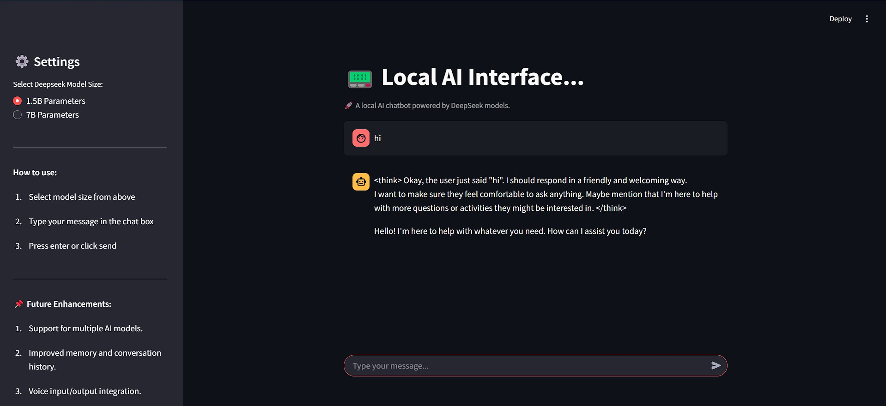

## local-AI-Interface
📟 local-AI-Interface is a chatbot application powered by a locally hosted AI model, built using Streamlit, LangChain, and DeepSeek. This project provides an interactive user interface for seamless AI conversations without relying on external APIs or cloud services.


## Chatbot Features ✨
- 🔒 100% local execution - no internet required with help of models from Ollama
- 🎛️ Model size selection (1.5B or 7B parameters)
- 💬 Real-time chat with streaming responses
- 📚 Conversation history persistence
- ⚡ LangChain integration for efficient processing

## 📌 Future Enhancements
- 🔄 Multi-Model Support – Compatible with DeepSeek, LLaMA, Mistral, Falcon
- 🎤 Voice Input (Future Feature) – Talk to AI using speech-to-text
- 🌙 Dark Mode UI (Coming Soon) – A sleek, customizable theme

## Prerequisites 📋
- Python 3.8+
- [Ollama](https://ollama.ai/) installed locally
- Deepseek models pulled from Ollama
- 8GB+ RAM (16GB recommended for 7B model)

## Installation ⚙️

### 1. Set Up Ollama
```bash
# Start Ollama service (keep running in separate terminal)
ollama serve