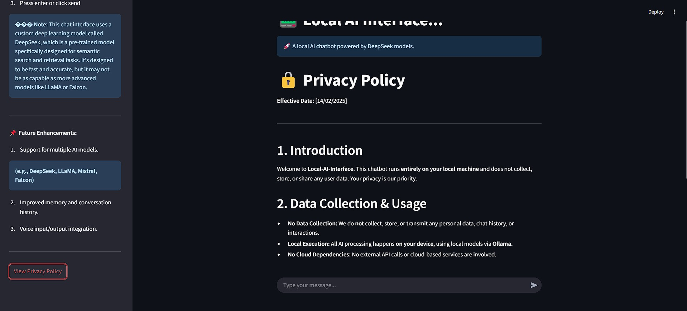

# Privacy Policy

**Effective Date:** [14/02/2025]

## 1. Introduction
Welcome to **Local-AI-Interface**. This chatbot application operates **entirely on your local machine** and does not collect, store, or share any user data. Your privacy and security are our top priorities.

## 2. Data Collection & Usage
- **No Data Collection:** This application does **not** collect, store, or transmit any personal data, chat history, or user interactions to external servers.
- **Local Execution:** All AI processing happens **on your device**, using local models via **Ollama**.
- **No Cloud Dependencies:** There are no external API calls or cloud-based services involved in processing your data.

## 3. Security
- Since the chatbot runs **entirely offline**, your conversations remain **private** and **secure**.
- Users are responsible for securing their device against unauthorized access.

## 4. Third-Party Services
- The application may use **open-source AI models** (such as DeepSeek, LLaMA, Mistral) which are hosted locally.
- Any models you download from third-party sources (e.g., Ollama) are subject to their respective privacy policies.

## 5. User Control & Data Deletion
- As no data is stored or transmitted, **no action is needed** to delete data—your chats are cleared when you close the app.
- If conversation history is enabled, it is stored **locally** on your device, and you can delete it anytime.

## 6. Changes to This Policy
We may update this Privacy Policy to reflect changes in functionality or security enhancements. Any updates will be available in the project’s GitHub repository.

## 7. Contact Information
If you have any questions about this Privacy Policy, feel free to contact us:

🔗 **GitHub:** [Repository Link](https://github.com/sahilkumardhala/local-AI-Interface])

